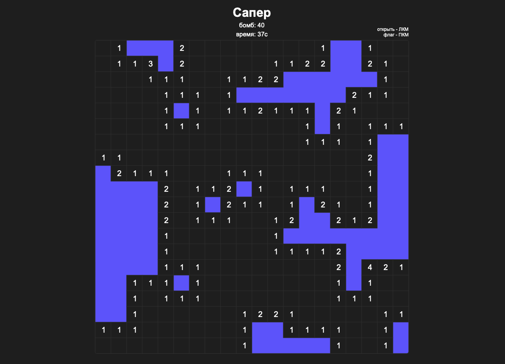

# SAPPER game

Modern version of the classic sapper game

[PLAY HERE](https://danilchugaev.github.io/sapper/)

## Contents
  - [Prerequisites](#prerequisites)
  - [Features](#features)
  - [Future improvements](#future-improvements)
  - [Run Locally](#run-locally)
  - [Build For Production](#build-for-production)
  - [Lint project](#lint-project)
  - [License](#license)

<p align="center">
  
</p>

## Prerequisites

- [npm](http://npmjs.com)
- [Node.js](https://nodejs.org/en/download/)

## Features

- sapper game
- store the best time of the level in the localstorage
- store the selected level in the localstorage
- if the game ends badly, the flags set by mistake are not removed, and the flags set into bombs are correctly turned into bombs
- if the flag is placed in an empty field - do not touch it when opening an empty field

## Future improvements

- 1 click always on an empty cell
- pause in the game
- change color scheme
- come up with an algorithm for generating bombs so that there are no situations when you need to randomize, or at least minimize them
- instead of seconds, do a normal time count with minutes
- adaptive screen size
- show the region of the central cell when hovering over it

## Run Locally

Clone the project

```bash
  git clone git@github.com:DanilChugaev/sapper.git
```

Go to the project directory

```bash
  cd sapper
```

Install dependencies

```bash
  npm install
```

Start the development server

```bash
  npm run dev
```

## Build For Production

To generate production build

```bash
 npm run build
```

## Lint project

To lint code in project

```bash
 npm run lint
```

## License

[MIT](https://choosealicense.com/licenses/mit/)